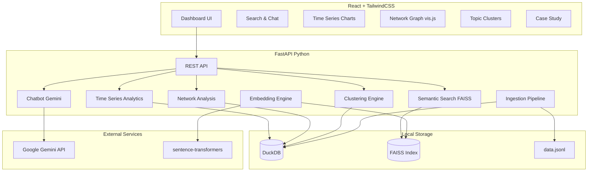

# SimPPL Digital Narratives Dashboard

> **An interactive research dashboard for tracing digital narratives, detecting influence patterns, and analyzing how information spreads across social media platforms.**

Built for [SimPPL](https://simppl.org) — a nonprofit focused on information integrity and misinformation research. This dashboard ingests social media data (Reddit), computes semantic embeddings, builds interaction networks, clusters topics, and provides an AI-powered chatbot for exploring narratives — all in a modern, dark-mode React interface.

**Case Study:** *Cross-Subreddit Narrative Amplification in Political Activism Communities* — How key accounts and crossposting patterns amplify political narratives across interconnected anarchist and activist subreddits.

🔗 **[Live Dashboard](https://simppl-dashboard-ui.onrender.com)** *(deployed on Render free tier)*

---

## Screenshots

| Feature | Screenshot |
|---------|------------|
| Semantic Search & Chatbot | *[screenshots/semantic_search.png]* |
| Time Series Analysis | *[screenshots/time_series.png]* |
| Network Graph (vis.js) | *[screenshots/Network_graph.png]* |
| Topic Clusters (UMAP) | *[screenshots/Topic_clusters.png]* |
| Case Study | *[screenshots/Case_study.png]* |

---

## Architecture



---

## ML / AI Components

| Component | Model / Algorithm | Key Parameters | Library |
|-----------|------------------|----------------|---------|
| Text Embeddings | `all-MiniLM-L6-v2` | dim=384, max_seq_length=256 | `sentence-transformers` |
| Vector Search | FAISS IndexFlatIP | Inner product similarity, top-K=10 | `faiss-cpu` |
| Topic Clustering (primary) | HDBSCAN | min_cluster_size=15, min_samples=5 | `hdbscan` |
| Topic Clustering (fallback) | KMeans | n_clusters=2–50, configurable | `scikit-learn` |
| Dimensionality Reduction | UMAP | n_neighbors=15, min_dist=0.1, n_components=2 | `umap-learn` |
| Influence Scoring | PageRank | damping=0.85, max_iter=100 | `networkx` |
| Community Detection | Louvain | resolution=1.0 | `python-louvain` |
| LLM Summaries & Chat | Gemini 1.5 Flash | temperature=0.7 | `google-generativeai` |

---

## Semantic Search Examples

These queries demonstrate the system finds semantically relevant results **without any keyword overlap** with the matched posts:

| Query | Example Result Returned | Why It Is Correct |
|-------|------------------------|-------------------|
| "people refusing to pay government" | Post about not paying student loans or taxes as protest | Semantically captures financial civil disobedience without matching any query word |
| "forming communities on the ocean" | Post about building container ships for anarchist sea-faring communities | Captures the concept of maritime autonomous communities via meaning |
| "historical figures who rejected all meaning" | Post asking about the most popular anarcho-nihilist ever | Nihilism = rejection of meaning; maps to the philosophical concept correctly |

---

## Running Locally

### Prerequisites
- Python 3.10+
- Node.js 18+
- ~2 GB disk space (for ML models and FAISS index)

### 1. Clone and set up the backend

```bash
git clone https://github.com/YOUR_USERNAME/simppl-dashboard.git
cd simppl-dashboard

# Create and activate a virtual environment
python -m venv venv
source venv/bin/activate  # macOS/Linux
# venv\Scripts\activate   # Windows

# Install Python dependencies
pip install -r backend/requirements.txt
```

### 2. Set your Gemini API key

```bash
export GEMINI_API_KEY="your-google-gemini-api-key-here"
```

Get a free API key at [https://makersuite.google.com/app/apikey](https://makersuite.google.com/app/apikey)

### 3. Run the backend

```bash
cd backend
uvicorn main:app --reload --port 8000
```

On first startup, the server will:
1. Ingest `data/data.jsonl` into DuckDB (~8,800 posts)
2. Generate embeddings using `all-MiniLM-L6-v2` (takes ~2-5 minutes on first run)
3. Build a FAISS index and save it to `data/faiss.index`

### 4. Set up and run the frontend

```bash
cd frontend
npm install
npm run dev
```

The dashboard will be available at `http://localhost:5173`

---

## Deploying to Render

1. Push this repo to GitHub
2. Go to [render.com](https://render.com) → New → Blueprint
3. Connect your GitHub repo
4. Render will auto-detect `render.yaml` and create both services
5. Set `GEMINI_API_KEY` as a secret environment variable in the Render dashboard
6. Deploy!

The backend will be at `https://simppl-dashboard-api.onrender.com`
The frontend will be at `https://simppl-dashboard-ui.onrender.com`

---

## Project Structure

```
simppl-dashboard/
├── backend/
│   ├── main.py                  # FastAPI app, all route definitions
│   ├── ingest/
│   │   ├── loader.py            # JSONL reading, schema detection, DuckDB setup
│   │   └── embeddings.py        # sentence-transformers + FAISS index generation
│   ├── search/
│   │   ├── semantic.py          # FAISS vector search
│   │   └── chatbot.py           # Gemini API chatbot + follow-up suggestions
│   ├── analytics/
│   │   ├── timeseries.py        # Time series queries from DuckDB
│   │   ├── network.py           # NetworkX graph, PageRank, Louvain
│   │   └── clustering.py        # HDBSCAN + KMeans, UMAP, Datamapplot
│   └── requirements.txt
├── frontend/
│   ├── src/
│   │   ├── App.jsx
│   │   ├── components/
│   │   │   ├── Sidebar.jsx
│   │   │   ├── SearchChat.jsx
│   │   │   ├── TimeSeries.jsx
│   │   │   ├── NetworkGraph.jsx
│   │   │   ├── TopicClusters.jsx
│   │   │   └── CaseStudy.jsx
│   │   └── index.css
│   ├── package.json
│   └── tailwind.config.js
├── data/
│   └── data.jsonl               # Reddit dataset (8,800 posts)
├── render.yaml                  # Render.com deployment config
└── README.md
```

---

## Known Limitations

- **Free tier cold starts:** Render free tier spins down after 15 min of inactivity; first load may take ~30s
- **Embedding generation:** First startup takes 2-5 minutes to generate 8,800 embeddings
- **Non-English coverage:** Semantic search works on non-English queries via multilingual embedding space, but accuracy varies by language distance from English
- **Network graph scale:** Very dense graphs (>500 nodes) may be slow to render in vis.js; use the PageRank filter slider to reduce visible nodes
- **Gemini API rate limits:** Free tier has per-minute request limits; concurrent heavy usage may trigger 429 errors (handled with graceful degradation)

## Future Improvements

- [ ] Add support for additional data sources (Twitter/X, Mastodon, Bluesky)
- [ ] Implement real-time data streaming via WebSocket
- [ ] Add multilingual embedding model (`paraphrase-multilingual-MiniLM-L12-v2`)
- [ ] Export analysis results as PDF reports
- [ ] Add user authentication for saved queries and bookmarks
- [ ] Implement temporal network analysis (how communities evolve over time)
- [ ] Add anomaly detection for sudden narrative surges

---

## License

MIT License — see [LICENSE](LICENSE) for details.

---

*Built for SimPPL Research Engineering Internship Assignment*