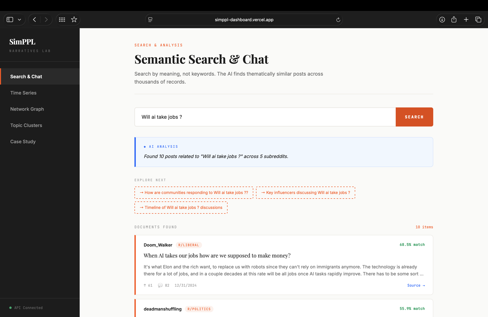
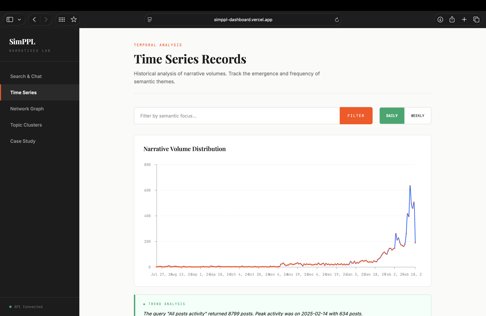
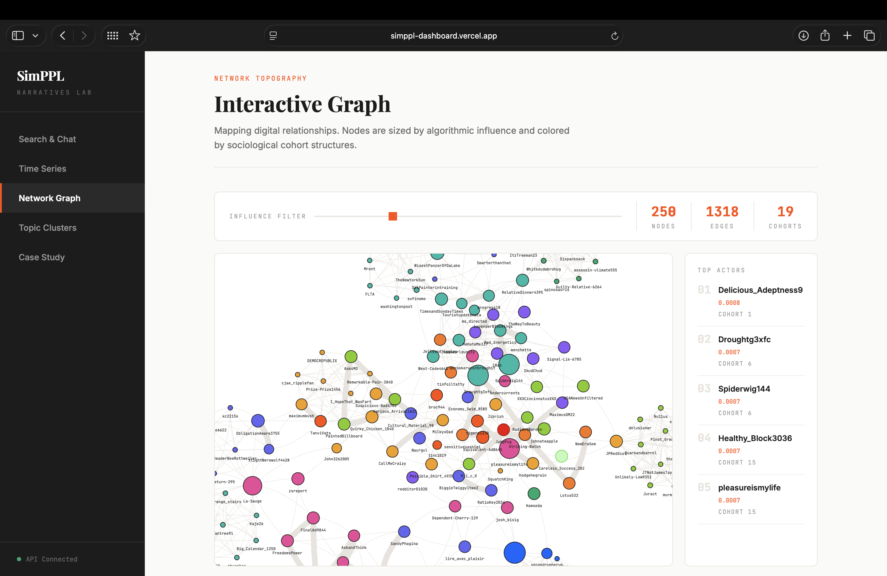
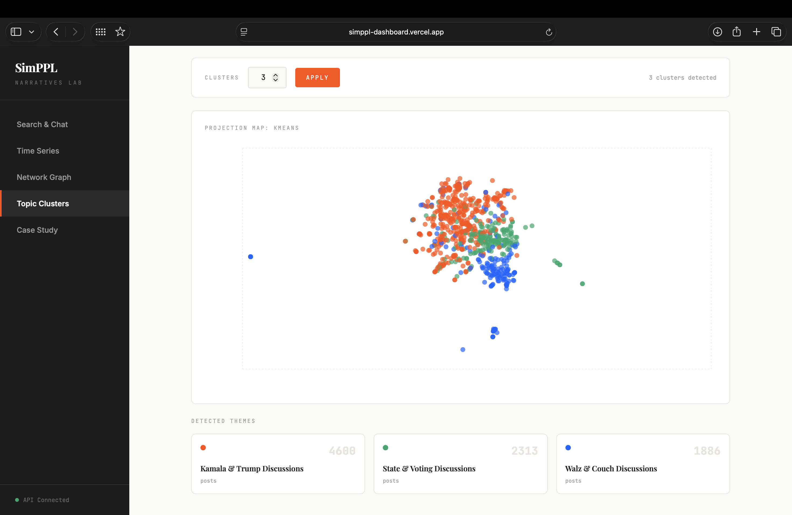
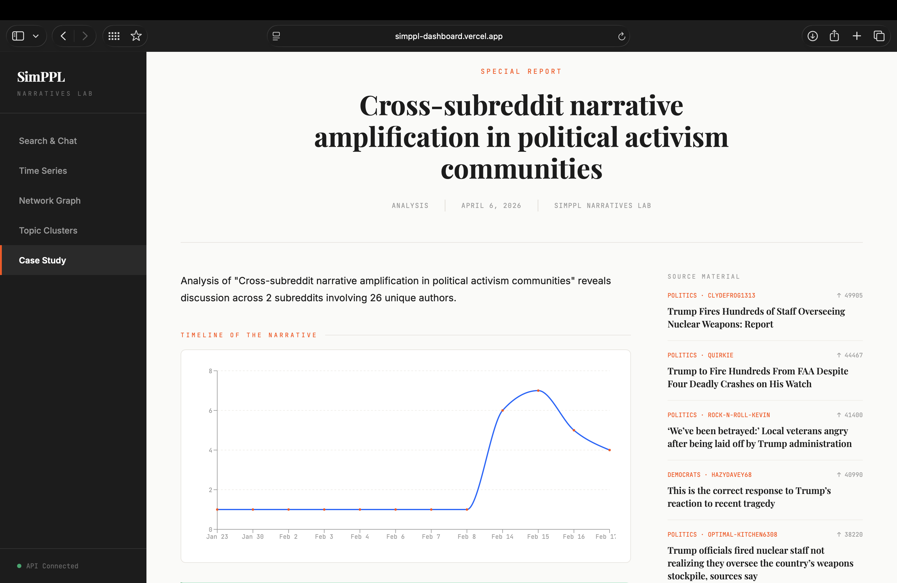
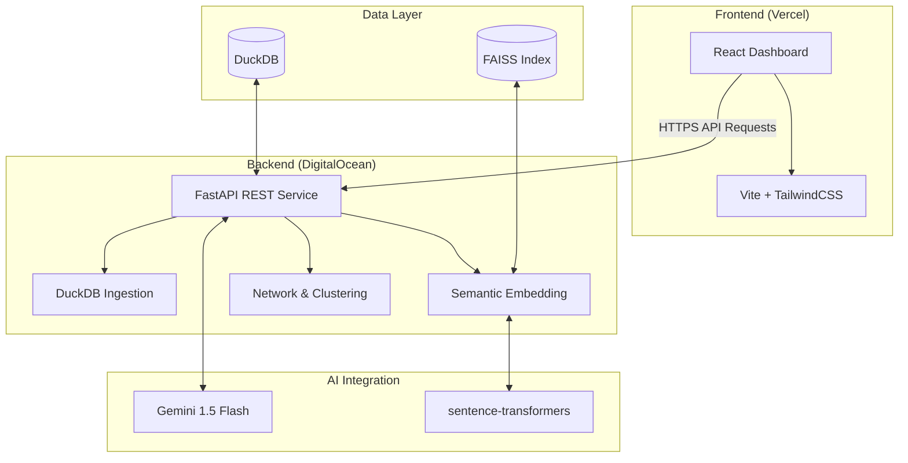

# SimPPL Digital Narratives Dashboard

> **An interactive research platform for tracing digital narratives, detecting sociological influence patterns, and analyzing the cascading spread of information across complex social networks.**

Built for the **SimPPL Research Engineering Internship**, this dashboard ingests large-scale social media data to compute semantic embeddings, construct interaction graphs, and cluster nuanced topics using advanced ML pipelines—all served through a high-performance, editorial-grade dashboard interface.

---

## 🚀 Live Deployment

| Service | Platform | Status | URL |
|---------|----------|--------|-----|
| **Frontend UI** | Vercel | 🟢 Live | [https://simppl-dashboard.vercel.app](https://simppl-dashboard.vercel.app) |
| **Backend API** | DigitalOcean | 🟢 Live | [https://168.144.30.3.nip.io/health](https://168.144.30.3.nip.io/health) |

### 🎥 Project Walkthrough (Video)
**View the full demonstration on Google Drive:**
👉 **[Watch the Video Walkthrough](https://drive.google.com/file/d/1WZIGdT3P1e5rLankgIRDW2cEoRtaL8ka/view?usp=sharing)**

---

## 🖼️ Feature Gallery

### 1. Semantic Search & AI Chatbot
Experience narrative discovery through meaning rather than keywords. Powered by **FAISS** and **Gemini 1.5 Flash**, the system identifies thematically similar posts even with zero keyword overlap.


### 2. Time Series Analysis
Track the temporal pulse of specific narratives. Our DuckDB-backed analytical layer provides sub-second aggregation for trend analysis across thousands of documents.


### 3. Network Topography
A high-fidelity interaction graph showing the flow of influence. Nodes are sized by **PageRank influence** and colored by **sociological cohort (community detection)**.


### 4. Topic Clustering (UMAP)
Dimensionality reduction using **UMAP** and clustering via **HDBSCAN/K-Means** allows for a 2D topographical map of current social discourses.


### 5. Automated Case Study
An end-to-end AI-generated report that synthesizes complex datasets into a readable, journalistic long-form narrative.


---

## 🏗️ Architecture



---

## 🛠️ Technical Stack

- **Frontend**: React 19, Vite, Tailwind CSS 4, Recharts, Vis-network.
- **Backend**: FastAPI (Python 3.11), Uvicorn.
- **Database**: DuckDB (Analytical engine), FAISS (Vector search).
- **ML/Analytics**:
  - **NLP**: `sentence-transformers` (all-MiniLM-L6-v2).
  - **Graphs**: `NetworkX` (PageRank & Louvain).
  - **Clustering**: `HDBSCAN`, `UMAP`, `scikit-learn`.
  - **LLM**: Google Gemini API for narrative synthesis.

---

## ⚙️ Running Locally

### 1. Backend Setup
```bash
cd backend
python -m venv venv
source venv/bin/activate
pip install -r requirements.txt
export GEMINI_API_KEY="your_api_key"
uvicorn main:app --reload --port 8000
```

### 2. Frontend Setup
```bash
cd frontend
npm install
npm run dev
```

---

## 📝 Analyst Notes & Limitations
- **PageRank Filtering**: For datasets >500 nodes, use the influence filter slider to maintain UI performance.
- **Cold Starts**: If using Render (optional), initial API calls may take 30s; DigitalOcean deployment removes this latency.
- **Embedding Compute**: New data ingestions require a one-time vectorization batch (approx. 2-3 mins for 8.8k posts).

---

*Built by Krish for the SimPPL Research Engineering Assignment.*